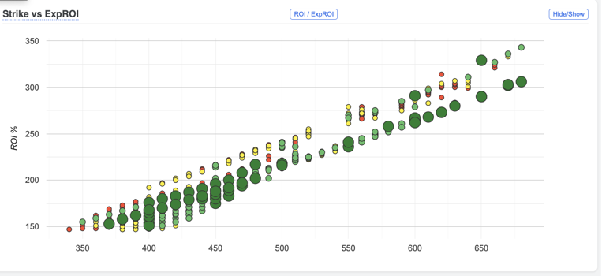
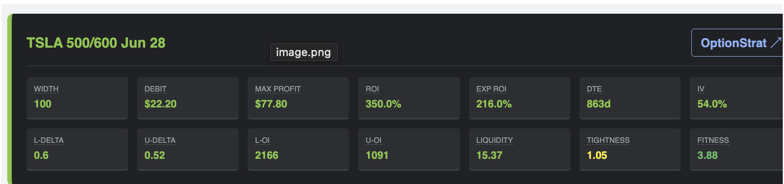
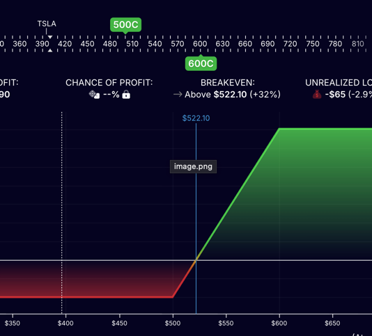
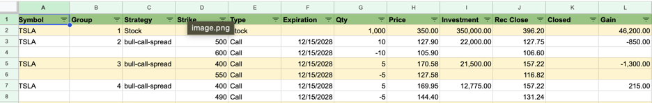
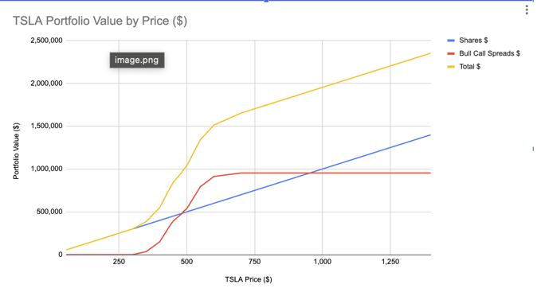
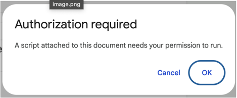

# SpreadFinder

SpreadFinder scans option prices to find attractive bull call spread opportunities. It ranks spreads by expected ROI using a probability-of-touching the upper leg price on or before expiration, filters by liquidity, and displays results in interactive charts.

**[Try it now — make a copy of the template spreadsheet](https://docs.google.com/spreadsheets/d/1MYMzTpoGlKuAXFyN8eGePmAsZ8R6379zhDoe-JHm7D0/copy)**

The template includes real TSLA option prices for June 2028 and December 2028 LEAP expirations.

## Understanding the Charts

Each bubble represents a potential **bull call spread** you could purchase. The bubbles are color-coded by fitness score percentile to help you quickly identify the best opportunities:

- **Dark Green (large)** — Top 10% — Best opportunities with favorable liquidity and tight bid/ask spreads
- **Light Green** — Top 10–40% — Good opportunities
- **Yellow** — Top 40–75% — Moderate opportunities
- **Red** — Bottom 25% — Lower quality (poor liquidity or wide spreads)
- **Gray** — Conflicts with existing holdings in your portfolio (you cannot be long and short the same option)


Expected ROI is based on an estimated probability that the stock price will reach the upper strike before expiration. This accounts for: (1) the chance the spread expires fully in-the-money at max profit, or (2) the price touches the upper strike earlier, allowing you to exit early yet still capture ~80% of gains

Selecting a Spread

Click any bubble to see its details in the panel below, including strike prices, debit cost, ROI, expected ROI, and liquidity metrics.




Double-click a bubble to open it in OptionStrat for visual profit/loss analysis.



You can also upload your portfolio and transactions from Etrade, or play around with a Sample portfolio that is built into the app



If you upload transactions, it automatically detects bull-call-spread, iron-condors and iron-butterflies.   Once your portfolio has been built, you can visualize potential results as TSLA rises (we hope!)


You can upload fresh option prices as the market changes and redraw these graph with the latest data.

This is beta code, so please keep your expectations low.  But I wrote it for myself to help me chose the best options and monitor my spreads, found it useful and wanted to share with others.


---

## Installation

1. Open the [SpreadFinder Template Spreadsheet](https://docs.google.com/spreadsheets/d/1MYMzTpoGlKuAXFyN8eGePmAsZ8R6379zhDoe-JHm7D0/copy)
2. Click "Make a copy"
3. The Apps Scripts will be automatically installed
4. Wait for the OptionUtils menu to appear
5. Try to run the first Initialize/Clear Project menu item



6. You will be prompted for Authorization from Google. Which for now, can read any/all files in your google drive so you can upload more option prices and your own portfolios;  which is a bit scary.  But the source code is available here: https://github.com/markriggins/OptionUtils
If enough users are interested in using it, I can add a file chooser to the app so you can pickup specific files from your local hard drive and no Google permissions will be necessary.  or each option, it gives a recommended price for purchasing it, and for selling it, which has proven to be useful.  Paying full Ask can be expensive, but super low bidding can be ineffective. 
7. Once authorized re-run Initialize/Clear Project and look for more detailed instructions in the README sheet

---

## How It Works

The library architecture means:
- All logic lives in the SpreadFinder library
- Your spreadsheet has thin wrapper stubs that delegate to the library
- When the library is updated, you automatically get the latest version (after reload)

### Why Stubs Are Needed

Google Apps Script has limitations that require local wrapper functions:
- **Custom functions** (cell formulas like `=XLookupByKeys(...)`) must be defined locally
- **Triggers** (`onOpen`, `onEdit`) must be defined locally
- **Dialog callbacks** (`google.script.run`) must call local functions

The stubs in `Code.gs` simply forward calls to `SpreadFinder.functionName()`.

---

## Features

### Portfolio Value Charts

For each symbol, generates a `<SYMBOL>PortfolioValueByPrice` tab with:
- Config table for price range settings
- Data table with value calculations
- Four charts: Portfolio $ value, Portfolio % ROI, Individual spreads $, Individual spreads %

### SpreadFinder

Scans option prices to find attractive bull call spread opportunities:
1. Run **OptionTools > Run SpreadFinder** to analyze spreads
2. Run **OptionTools > View SpreadFinder Graphs** for interactive charts
3. Click a bubble to see details; double-click to open in OptionStrat

Configure filters on the SpreadFinderConfig sheet (symbol, strike range, min ROI, etc.) then re-run to see filtered results.

### Custom Functions

Use these in cell formulas:

| Function | Description |
|----------|-------------|
| `XLookupByKeys(keys, keyHeaders, returnHeaders, sheet)` | Multi-key lookup with caching |
| `X2LOOKUP(key1, key2, col1, col2, returnCol)` | Two-key lookup |
| `X3LOOKUP(key1, key2, key3, col1, col2, col3, returnCol)` | Three-key lookup |
| `detectStrategy(strikes, types, qtys)` | Detects option strategy from legs |
| `recommendClose(symbol, exp, strike, type, qty, patience)` | Recommended closing price |
| `coalesce(range)` | First non-empty value |

---

## Data Sources

### Option Prices from Barchart.com

1. Go to barchart.com, navigate to Options for your symbol
2. Select expiration, choose "Stacked" view
3. Download CSV
4. Save to Google Drive under `<DataFolder>/OptionPrices/`
5. Run **OptionTools > Refresh Option Prices**

### Transactions from E*Trade

1. Download transaction CSV from E*Trade
2. Save to Google Drive under `<DataFolder>/Etrade/`
3. Run **OptionTools > Import Portfolio from E*Trade**

---

## Supported Positions

That tab contains:
- A per-symbol Config table
- A generated data table
- A line chart of **Price vs Portfolio Value**

### Supported positions
- Common stock
- Bull call spreads

### Tables vs Named Ranges (important)

Google Sheets **Tables** are not readable by Apps Script.

**Convention used:**
- Table name: `BullCallSpreads`
- Named range: `BullCallSpreadsTable`

The script:
1. Tries `BullCallSpreads`
2. Falls back to `BullCallSpreadsTable`

If a Table exists but the Named Range does not, the script tells you exactly what to create.

---

## Menus and Triggers

`onOpen.js` wires menu items into the spreadsheet UI.

`PlotPortfolioValueByPrice` also installs an `onEdit(e)` trigger that:
- Rebuilds only when a Config table is edited
- Ignores all other edits

---

## Design Philosophy

- **Spreadsheets are the source of truth**
- **Scripts accelerate, not obscure**
- **Explicit > magical**
- **Performance matters**
- **Fill realism matters**

This repo is opinionated — deliberately.

---

## Apps Script Library

Available as a Google Apps Script library:

- **Library name:** SpreadFinder
- **Script ID:** `1qvAlZ99zluKSr3ws4NsxH8xXo1FncbWzu6Yq6raBumHdCLpLDaKveM0T`
- **URL:** https://script.google.com/macros/library/d/1qvAlZ99zluKSr3ws4NsxH8xXo1FncbWzu6Yq6raBumHdCLpLDaKveM0T/58

---

## Development

### Pushing Changes to the Library

```bash
# Push local changes to Apps Script
clasp push

# Pull changes from Apps Script
clasp pull
```

### Testing

Run `runAllTests()` or individual `test_*` functions in the Apps Script editor.

---

## License

MIT License.

Use it, fork it, adapt it, improve it.

---

## Author

**Mark Riggins**

Built to support real-world option portfolios where Google Sheets remains the fastest modeling surface.
