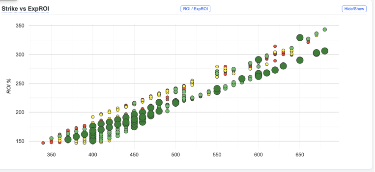
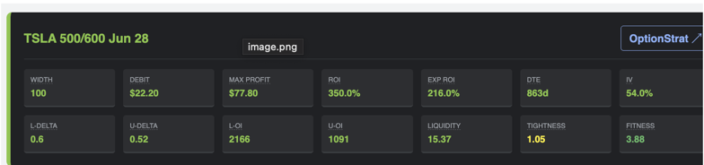
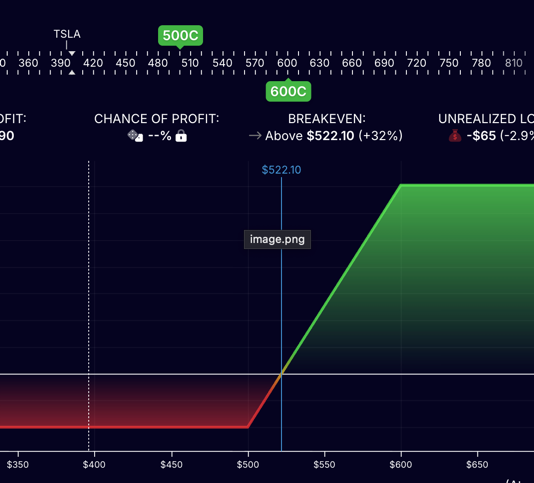
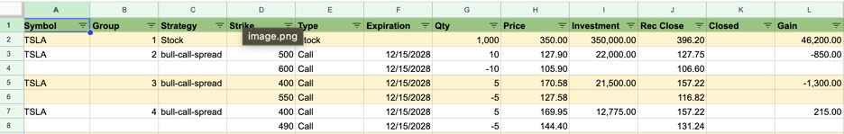
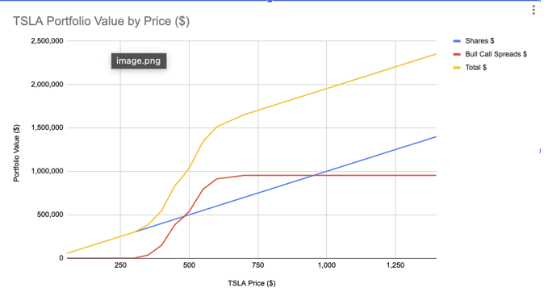

# OptionUtils

Option portfolio analysis tools for Google Sheets. SpreadFinder scans option prices to find attractive bull call spread opportunities. Portfolio tools let you track positions and visualize profit/loss scenarios.

**[Try it now — make a copy of the template spreadsheet](https://docs.google.com/spreadsheets/d/1MYMzTpoGlKuAXFyN8eGePmAsZ8R6379zhDoe-JHm7D0/copy)**

The template includes real TSLA option prices for June 2028 and December 2028 LEAP expirations.

## Understanding the Charts

Each bubble represents a potential **bull call spread** you could purchase. The bubbles are color-coded by fitness score percentile to help you quickly identify the best opportunities:

- **Dark Green (large)** — Top 10% — Best opportunities with favorable liquidity and tight bid/ask spreads
- **Light Green** — Top 10–40% — Good opportunities
- **Yellow** — Top 40–75% — Moderate opportunities
- **Red** — Bottom 25% — Lower quality (poor liquidity or wide spreads)
- **Gray** — Conflicts with existing holdings in your portfolio (you cannot be long and short the same option)


### Expected ROI Explained

**Expected ROI** uses a probability-weighted model based on a key insight: you don't need the stock to expire above the upper strike to profit. If it *touches* that price anytime before expiration, you can exit early at ~80% of max profit.

**The calculation:**

1. **Probability of Touch** = Upper strike's delta × 1.6 (capped at 95%)
   - If upper strike has delta 0.30, probability of touch ≈ 48%
   - This is higher than "probability of expiring ITM" because the stock only needs to reach that price once

2. **Target Profit** = 80% of max profit (conservative early exit assumption)

3. **Expected Value**:
   ```
   EV = (Prob of Touch × Target Profit) + (Prob of Loss × -Debit)
   ```

4. **Expected ROI** = EV / Debit

**Example**: 400/450 spread, $20 debit, upper delta 0.35
- Max profit = $50 - $20 = $30
- Target profit = $30 × 0.80 = $24
- Prob of touch = 0.35 × 1.6 = 56%
- EV = (0.56 × $24) + (0.44 × -$20) = $13.44 - $8.80 = $4.64
- Expected ROI = $4.64 / $20 = **23%**

This is more realistic than raw ROI (150% in this example) because it weights by probability.

### SpreadFinderConfig Settings

When you first run SpreadFinder, it creates a **SpreadFinderConfig** sheet with settings you can customize:

| Setting | Default | Description |
|---------|---------|-------------|
| `symbol` | (from prices) | Comma-separated symbols to analyze (blank=all) |
| `minSpreadWidth` | 20 | Minimum spread width in dollars |
| `maxSpreadWidth` | 150 | Maximum spread width in dollars |
| `minLiquidityScore` | 0.50 | 0-1 scale (60% bid-ask spread, 25% volume, 15% OI) |
| `patience` | 60 | Minutes for price calculation (0=aggressive, 60=patient) |
| `minROI` | 2.0 | Minimum ROI (2.0 = 200% return) |
| `minStrike` | (auto) | Minimum lower strike price (default: 50% below current price) |
| `maxStrike` | (auto) | Maximum upper strike price (default: 100% above current price) |
| `minExpirationMonths` | 6 | Minimum months until expiration |
| `maxExpirationMonths` | 36 | Maximum months until expiration |

**Outlook settings** (optional — boost spreads aligned with your price target):

| Setting | Default | Description |
|---------|---------|-------------|
| `outlookFuturePrice` | (auto) | Your target price (default: current price + 25%) |
| `outlookDate` | (auto) | When you expect it (default: 1 year from now) |
| `outlookConfidence` | 0.5 | How confident you are, 0-1 (0.5 = 50%) |

### How Outlook Affects Fitness

The **Outlook Boost** adjusts fitness based on your price target, confidence, and timeline. Two components multiply together:

**1. Price Boost**

| Spread Position | Effect |
|-----------------|--------|
| Both strikes below target | Full boost — higher strikes get more |
| Straddles target | Partial boost |
| Both strikes above target | Penalty — worse the further above |

**2. Date Boost**

| Expiration | Effect |
|------------|--------|
| After target date | Slight boost (with falloff for much later) |
| Before target date | Penalty (may expire before move happens) |

**Example**: Target $500 by March 2027, 50% confidence
- 400/450 spread expiring June 2028: outlookBoost ≈ **1.6× fitness**
- 550/600 spread expiring Dec 2026: outlookBoost ≈ **0.8× fitness**

Higher confidence amplifies both boosts and penalties.

### Selecting a Spread

Click any bubble to see its details in the panel below, including strike prices, debit cost, ROI, expected ROI, and liquidity metrics.




Double-click a bubble to open it in OptionStrat for visual profit/loss analysis.



You can also upload your portfolio and transactions from Etrade, or play around with a Sample portfolio that is built into the app



If you upload transactions, it automatically detects bull-call-spread, iron-condors and iron-butterflies.   Once your portfolio has been built, you can visualize potential results as TSLA rises (we hope!)


You can upload fresh option prices as the market changes and redraw these graph with the latest data.

This is beta code, so please keep your expectations low.  But I wrote it for myself to help me chose the best options and monitor my spreads, found it useful and wanted to share with others.


---

## Installation

1. Open the [OptionUtils Template Spreadsheet](https://docs.google.com/spreadsheets/d/1MYMzTpoGlKuAXFyN8eGePmAsZ8R6379zhDoe-JHm7D0/copy)
2. Click "File > Make a copy"
3. The Apps Script will be automatically installed
4. Wait for the **OptionTools** menu to appear
5. Run **OptionTools > Initialize / Clear Project** to set up the README sheet

You'll be prompted to authorize the app. The app only accesses your spreadsheet — no Drive access is required. Source code: https://github.com/markriggins/OptionUtils

---

## How It Works

The library architecture means:
- All logic lives in the SpreadFinder library
- Your spreadsheet has thin wrapper stubs that delegate to the library
- When the library is updated, you automatically get the latest version (after reload)

### Custom Functions

The following functions are defined for use in Google Sheets:

| Function | Description |
|----------|-------------|
| `XLookupByKeys(keys, keyHeaders, returnHeaders, sheet)` | Multi-key lookup with caching |
| `X2LOOKUP(key1, key2, col1, col2, returnCol)` | Two-key lookup |
| `X3LOOKUP(key1, key2, key3, col1, col2, col3, returnCol)` | Three-key lookup |
| `detectStrategy(strikes, types, qtys)` | Detects option strategy from legs |
| `recommendClose(symbol, exp, strike, type, qty, patience)` | Recommended closing price |
| `COALESCE(range)` | First non-empty value |

---

## Data Sources

### Option Prices from Barchart.com

1. Go to barchart.com, navigate to Options for your symbol
2. Select expiration, choose "Stacked" view
3. Download CSV (filename format: `<symbol>-options-exp-YYYY-MM-DD-....csv` such as `tsla-options-exp-2026-03-13-weekly-show-all-stacked-03-02-2026.csv`)
4. Run **OptionTools > SpreadFinder > Upload Option Prices**
5. Select your CSV file(s) and click Upload

### Portfolio and Transactions from E*Trade

1. Download transaction history CSV from E*Trade (Accounts > Transactions > Download)
2. Optionally download portfolio CSV (Accounts > Portfolio > Download)
3. Run **OptionTools > Portfolio > Upload Portfolio/Transactions**
4. Select your files and choose "Add transactions" or "Clear and rebuild"

## Supported Positions
- Stock positions
- Bull call spreads
- Bull put spreads
- Iron condors
- Iron butterflies
- Single-leg options

---

## License

MIT License.

Use it, fork it, adapt it, improve it.

---

## Author

**Mark Riggins**

Built to support real-world option portfolios where Google Sheets can be a convenient tool for modeling.
